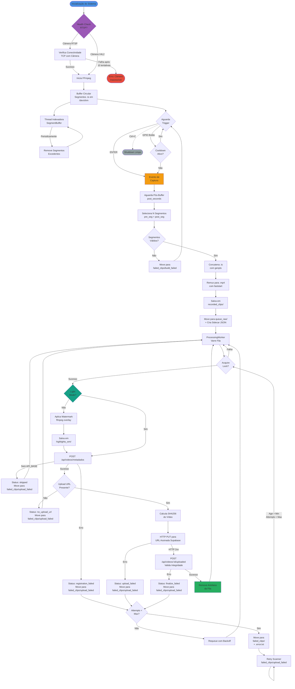
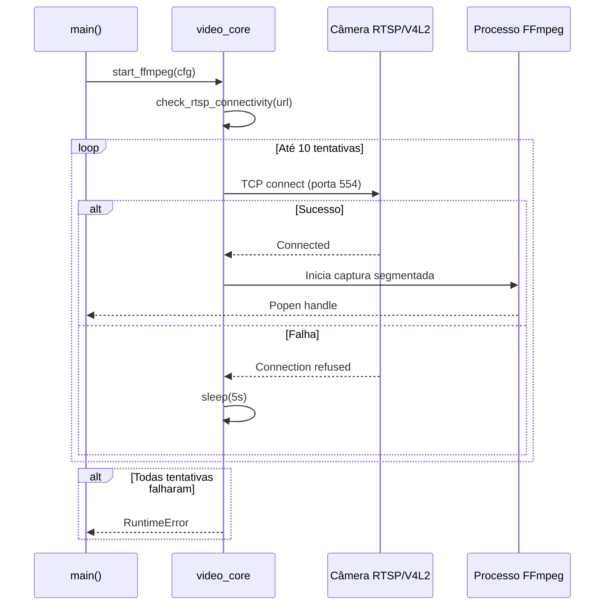
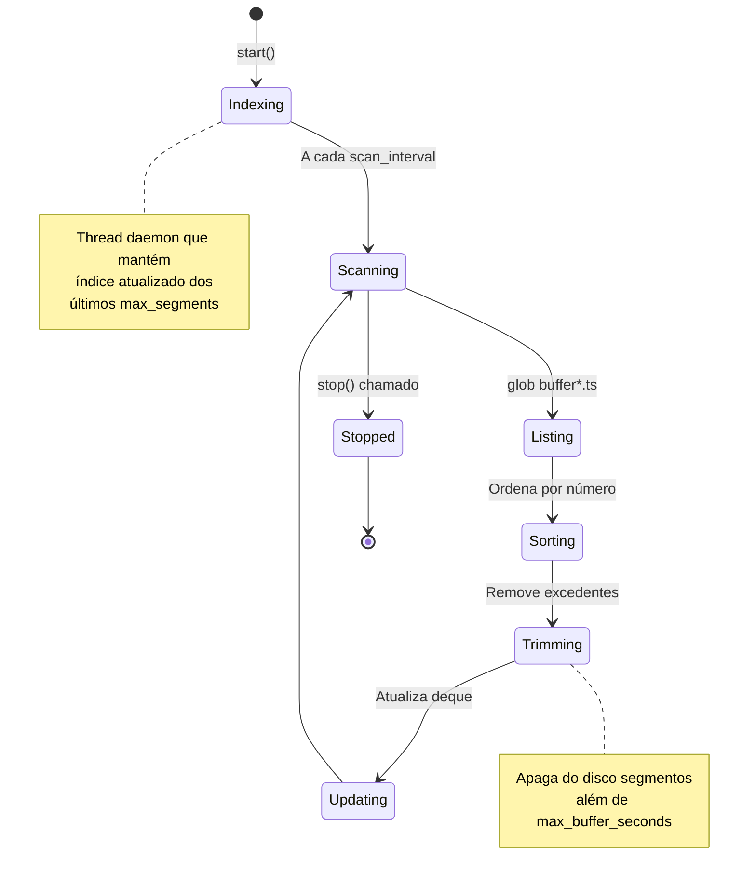
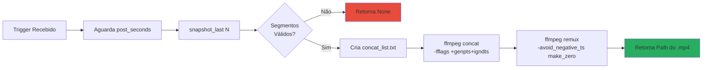
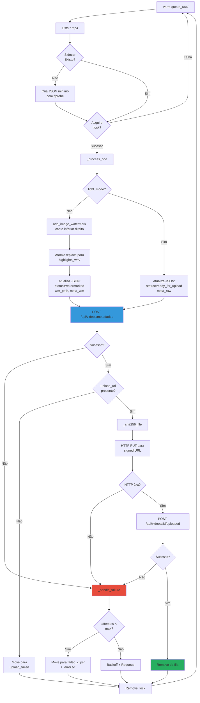
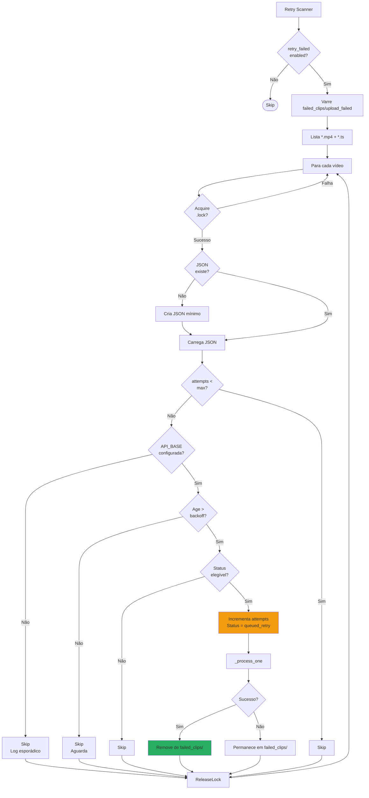

# Diagrama de Fluxo Funcional — Grava Nóis System

Este documento apresenta o fluxo funcional completo do sistema de captura e processamento de vídeos do Grava Nóis.

## Visão Geral

O sistema captura vídeo continuamente de uma câmera RTSP ou V4L2, mantém um buffer circular de segmentos, e ao receber um trigger (botão GPIO ou ENTER), constrói um clipe highlight concatenando segmentos pré e pós-clique. O clipe é então enfileirado para processamento (opcional: watermark), upload para storage cloud via URL assinada, e registro no backend.

---

## Fluxo Principal (Mermaid)



---

## Componentes Principais

### 1. Inicialização e Health Check



### 2. Buffer Circular (SegmentBuffer)



### 3. Construção de Highlight



### 4. ProcessingWorker Pipeline



### 5. Retry Scanner (Falhas de Upload)



---

## Estrutura de Diretórios

```
grava_nois_system/
├── /dev/shm/grn_buffer/          # Buffer de segmentos (volátil)
│   └── buffer000001.ts ... bufferNNNNNN.ts
│
├── recorded_clips/               # Highlights recém-construídos
│   └── highlight_YYYYMMDD-HHMMSSZ.mp4
│
├── queue_raw/                    # Fila de processamento
│   ├── highlight_*.mp4           # Vídeo aguardando processamento
│   ├── highlight_*.json          # Sidecar com metadados
│   └── highlight_*.lock          # Lock para concorrência
│
├── highlights_wm/                # Vídeos com watermark (modo completo)
│   └── highlight_*.mp4
│
├── failed_clips/                 # Falhas organizadas por tipo
│   ├── build_failed/             # Erros na concatenação
│   ├── enqueue_failed/           # Erros ao enfileirar
│   └── upload_failed/            # Erros de upload (elegível para retry)
│       ├── highlight_*.mp4
│       ├── highlight_*.json
│       └── highlight_*.error.txt
│
├── logs/                         # Logs do sistema
│   └── ffmpeg.log                # Output do FFmpeg
│
└── files/                        # Assets
    └── replay_grava_nois.png     # Watermark
```

---

## Sidecar JSON (Evolução de Estados)

### Estado Inicial (Enqueue)
```json
{
  "type": "highlight_raw",
  "status": "queued",
  "created_at": "2025-10-14T12:30:00Z",
  "file_name": "highlight_20251014-123000Z.mp4",
  "size_bytes": 5242880,
  "sha256": null,
  "meta": {
    "codec": "h264",
    "width": 1280,
    "height": 720,
    "fps": 30.0,
    "duration_sec": 35.0
  },
  "pre_seconds": 25,
  "post_seconds": 10,
  "seg_time": 1,
  "attempts": 0
}
```

### Após Watermark (Modo Completo)
```json
{
  "status": "watermarked",
  "updated_at": "2025-10-14T12:30:15Z",
  "wm_path": "/path/highlights_wm/highlight_*.mp4",
  "meta_wm": { /* ffprobe do arquivo com watermark */ },
  "attempts": 0
}
```

### Após Registro no Backend
```json
{
  "remote_registration": {
    "status": "registered",
    "registered_at": "2025-10-14T12:30:20Z",
    "response": {
      "clip_id": "abc123xyz",
      "contract_type": "per_video",
      "storage_path": "temp/client-uuid/venue-uuid/abc123xyz.mp4",
      "upload_url": "https://storage.provider.com/signed-url?token=...",
      "expires_hint_hours": 12
    }
  }
}
```

### Após Upload Bem-Sucedido
```json
{
  "remote_upload": {
    "status": "uploaded",
    "http_status": 200,
    "reason": "OK",
    "attempted_at": "2025-10-14T12:31:00Z",
    "duration_ms": 8500,
    "file_size": 5242880
  }
}
```

### Após Finalização
```json
{
  "remote_finalize": {
    "status": "ok",
    "finalized_at": "2025-10-14T12:31:05Z",
    "response": {
      "validated": true,
      "sha256_match": true
    }
  }
}
```

### Falha com Pendência de Upload
```json
{
  "status": "upload_pending",
  "attempts": 1,
  "last_error": "HTTPError: 503 Service Unavailable",
  "local_fallback": {
    "status": "upload_pending",
    "reason": "upload_failed",
    "moved_at": "2025-10-14T12:31:10Z",
    "dest_dir": "/path/failed_clips/upload_failed"
  }
}
```

---

## Modos de Operação

### Light Mode (GN_LIGHT_MODE=1)
- **Sem watermark** e **sem thumbnail**
- Upload direto do vídeo da fila
- Menor uso de CPU/disco
- Ideal para Raspberry Pi 3B/4B com recursos limitados

### Modo Completo (GN_LIGHT_MODE=0)
- Aplica watermark no canto inferior direito
- Pode gerar thumbnail (opcional)
- Reencoda vídeo com H.264 CRF 20
- Maior qualidade visual, porém mais pesado

---

## Configurações Importantes (Variáveis de Ambiente)

| Variável | Padrão | Descrição |
|----------|--------|-----------|
| `GN_LIGHT_MODE` | `0` | Ativa modo leve (1=sim, 0=não) |
| `GN_SEG_TIME` | `1` | Duração de cada segmento em segundos |
| `GN_RTSP_URL` | - | URL da câmera RTSP (ex: rtsp://user:pass@ip:554/...) |
| `GN_RTSP_MAX_RETRIES` | `10` | Tentativas de conexão com câmera |
| `GN_RTSP_TIMEOUT` | `5` | Timeout por tentativa (segundos) |
| `GN_RTSP_PRE_SEGMENTS` | `6` | Segmentos pré-clique (modo RTSP) |
| `GN_RTSP_POST_SEGMENTS` | `3` | Segmentos pós-clique (modo RTSP) |
| `GN_GPIO_PIN` | - | Pino BCM para botão físico (ex: 17) |
| `GN_GPIO_COOLDOWN_SEC` | `120` | Cooldown entre disparos GPIO (segundos) |
| `GN_GPIO_DEBOUNCE_MS` | `300` | Debounce do botão (milissegundos) |
| `GN_MAX_ATTEMPTS` | `3` | Tentativas máximas de processamento |
| `API_BASE_URL` | - | URL base do backend |
| `API_TOKEN` | - | Token JWT/Bearer para autenticação |
| `CLIENT_ID` | - | UUID do cliente |
| `VENUE_ID` | - | UUID do venue/local |
| `GN_BUFFER_DIR` | `/dev/shm/grn_buffer` | Diretório do buffer de segmentos |
| `GN_LOG_DIR` | `/usr/src/app/logs` | Diretório de logs do FFmpeg |

---

## Casos de Uso e Cenários

### 1. Captura Normal (Sucesso Completo)
1. FFmpeg captura vídeo continuamente → segmentos em `/dev/shm`
2. SegmentBuffer indexa e remove excedentes a cada 1s
3. Usuário pressiona botão GPIO → cooldown iniciado
4. Sistema aguarda pós-buffer (3 seg no modo RTSP)
5. Concatena 9 segmentos (6 pré + 3 pós) em `.mp4`
6. Enfileira para `queue_raw/` com sidecar JSON
7. Worker processa: **Light Mode** → sem watermark
8. Registra metadados no backend → recebe `upload_url`
9. Calcula SHA256 e faz PUT para storage
10. Notifica backend (finalize) → validação OK
11. Remove artefatos da fila → **ciclo completo**

### 2. Falha de Conectividade (Retry Automático)
1. Raspberry Pi reinicia após queda de energia
2. Docker inicia antes da câmera completar boot
3. `check_rtsp_connectivity` tenta 10x com 5s de intervalo
4. Na 8ª tentativa, câmera responde → FFmpeg inicia
5. Captura continua normalmente

### 3. Falha de Upload (Pendência com Retry)
1. Vídeo processado e registrado no backend
2. Upload falha por timeout de rede (503 Service Unavailable)
3. Worker move para `failed_clips/upload_failed/`
4. JSON atualizado: `status=upload_pending`, `attempts=1`
5. Retry Scanner encontra arquivo após 2 minutos (backoff)
6. Reprocessa: tenta upload novamente
7. Se sucesso → remove de `upload_failed/`
8. Se falha e `attempts >= 3` → permanece em failed definitivo

### 4. Captura Sem Backend (Modo Offline)
1. `API_BASE_URL` não configurada
2. Vídeo capturado e concatenado normalmente
3. Worker pula registro remoto: `status=skipped`
4. Move para `failed_clips/upload_failed/` com reason=`no_api_configured`
5. Vídeo preservado localmente para upload posterior
6. Retry Scanner ignora (sem API não tenta)

---

## Troubleshooting

### Sintoma: "Nenhum segmento capturado — encerrando"

**Causa**: FFmpeg não iniciou ou câmera inacessível

**Verificações**:
```bash
# 1. Logs do sistema
docker logs grava_nois_system

# 2. Logs do FFmpeg
tail -f logs/ffmpeg.log

# 3. Teste manual de conectividade
nc -zv <IP_CAMERA> 554

# 4. Verifica se segmentos estão sendo criados
ls -lh /dev/shm/grn_buffer/
```

**Solução**: Ajustar `GN_RTSP_MAX_RETRIES` ou verificar rede/câmera

---

### Sintoma: Vídeos acumulando em `failed_clips/upload_failed/`

**Causa**: Backend inacessível ou credenciais inválidas

**Verificações**:
```bash
# 1. Testa endpoint do backend
curl -X POST "$API_BASE_URL/api/videos/metadados" \
  -H "Authorization: Bearer $API_TOKEN" \
  -H "Content-Type: application/json" \
  -d '{"test": true}'

# 2. Verifica JSON do sidecar
cat failed_clips/upload_failed/highlight_*.json | jq .remote_registration

# 3. Monitora retry scanner
docker logs grava_nois_system | grep "worker:retry"
```

**Solução**: Configurar `API_BASE_URL` e `API_TOKEN` corretos, verificar conectividade

---

### Sintoma: Cooldown impedindo capturas rápidas

**Causa**: `GN_GPIO_COOLDOWN_SEC` muito alto

**Solução**: Ajustar cooldown (padrão 120s):
```bash
# No .env
GN_GPIO_COOLDOWN_SEC=30  # 30 segundos entre capturas
```

---

## Melhorias Futuras (Roadmap)

- [ ] **Logs estruturados**: JSON logging para análise
- [ ] **Métricas**: Integração com Prometheus/Grafana
- [ ] **Watchdog**: Substituir polling por inotify/watchdog
- [ ] **Compressão adaptativa**: Ajustar CRF baseado em duração
- [ ] **Multi-câmera**: Suporte a múltiplas fontes simultâneas
- [ ] **Streaming ao vivo**: HLS/DASH para preview remoto
- [ ] **Retry inteligente**: Backoff exponencial com jitter
- [ ] **Health check HTTP**: Endpoint REST para monitoramento

---

## Referências

- [Documentação FFmpeg Segment](https://ffmpeg.org/ffmpeg-formats.html#segment)
- [pigpio Documentation](http://abyz.me.uk/rpi/pigpio/)
- [Supabase Storage Signed URLs](https://supabase.com/docs/guides/storage/uploads/signed-urls)
- [README Principal](../docs/README.md)
- [Instruções de Instalação](../INSTRUCTIONS.md)
